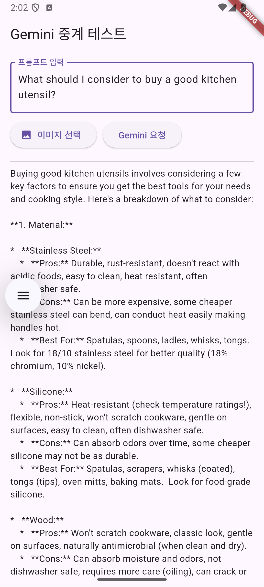

# daily_care

GDGoC 솔루션 챌린지용 프로젝트입니다.

## 주요 기능

- 음성, 이미지, 텍스트를 통한 Google Gemini와의 상호작용

## 주요 변경 사항

### 2025/5/1: 중간 서버 추가

- Google Gemini API와의 상호작용, 그리고 API 키 보호를 위한 중간 서버를 추가했습니다.
- 중간 서버로는 Google Cloud Run이 사용되었으며, 관련 파일은 `api-server` 폴더에 있습니다.
- Flutter 앱에서 직접 API를 호출하는 대신, 중간 서버에 요청을 보내면 중간 서버에서 받은 요청을 토대로 API를 호출하고 그 결과를 받아 Flutter 앱에 전달합니다.
- 이로 인해 API 키가 Flutter 앱에 노출되지 않으며, API 호출에 대한 비용 문제도 중간 서버에서 관리할 수 있습니다.

#### 중간 서버를 통한 Gemini 간접 호출

### 2025/4/30: Gemini 연동 성공

#### Gemini로부터 정보를 얻어오는 방법

- 마이크 버튼이나 이미지 버튼, 혹은 텍스트 필드를 통해 입력하고 'Gemini 요청' 버튼을 입력하면 잠시 후 결과가 아래 화면에 출력됩니다.
- 비용 문제나 API 키 보호 관련 문제 등 더 자세히 알아봐야 할 것이 아직 많고, 어디까지나 최소한의 기능 구현을 위한 데모 단계입니다.
- 키 보호 관련 문제로 인해 API 키가 담긴 파일은 업로드하지 않았습니다.

#### Gemini 연동 성공 화면

